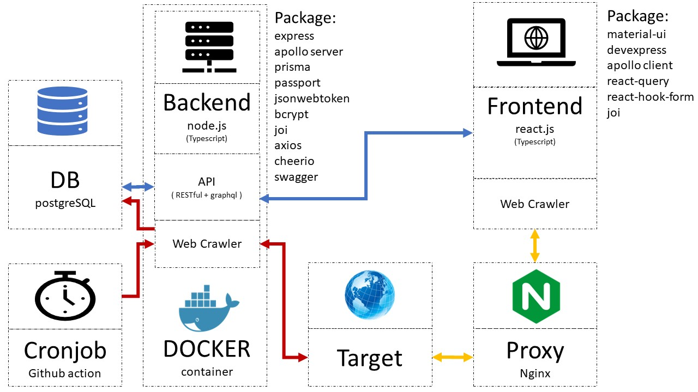

# side project - 小氣鬼的電影追蹤工具

<!-- PROJECT SHIELDS -->

[![Contributors][contributors-shield]][contributors-url]
[![Forks][forks-shield]][forks-url]
[![Stargazers][stars-shield]][stars-url]
[![Issues][issues-shield]][issues-url]

<!-- PROJECT LOGO -->

  <!-- 未來新增圖片用 -->
  <!--  -->

  <h3 align="center">娛樂省錢第一解決方案</h3>
  

    一个"小氣鬼"心目中的娛樂省錢方案！
     
     
    探索本專案的檔案 »
     
    <a href="https://github.com/yongsin0129/project-cheapskate"><strong>後端</strong></a>
    <a href="https://github.com/yongsin0129/project-cheapskate-fe"><strong>前端</strong></a>
     
     
    <a href="https://github.com/yongsin0129/project-cheapskate">查看README</a>
    ·
    <a href="https://github.com/yongsin0129/project-cheapskate/issues">回報Bug</a>
    ·
    <a href="https://github.com/yongsin0129/project-cheapskate/issues">提出新功能</a>
  

## 目录

- [緣起](#緣起)
- [功能](#功能)
- [整體架構](#整體架構) 
- [開發項目拆分](#開發項目拆分)
  - [後端](#後端)
  - [前端](#前端)
- [作者](#作者)
- [鳴謝](#鳴謝)

## 緣起
小氣鬼因為本身很小氣，電影鮮少在首輪就去觀看，

總是將片名記在心中，等著進二輪片單或上串流時再來欣賞。

但...人的記性總是不好，常常忘記這些感興趣的電影，等到有閒暇之餘時，落入無片可看的窘境。

於是這支 app 就開始進入開發階段。

## 功能
- 爬蟲每12小時更新一次資料庫的電影清單
- 使用者可以創建自已的帳號
- 使用者可以創建自已的電影收藏清單
- 使用者可以查看最新上線的首輪電影
- 使用者可以查看最新上線的二輪電影
- 當收藏清單中的電影進入二輪 or 串流時，收到通知 (預計用 lineBot 來通知)

## 整體架構

  

## 開發項目拆分
### 後端
- 使用 爬蟲 + Cronjob 更新資料庫的電影清單  (done)
- 會員系統 (done - 使用 RESTful 實作) 
- 電影清單 (done - 使用 GraphQL 實作)
- 使用者添加及刪除收藏清單 (done - 使用 GraphQL 實作)
- swagger 建立 Restful API 文檔 (done)
- GraphQL 建立 GraphQL API 文檔 (done)

RESTful API 文檔 : <a href="https://cheapskate.fly.dev/"><strong>swagger doc</strong></a>

GraphQL API 文檔 : <a href="https://studio.apollographql.com/graph/syu-yongsin-cheapskate/explorer?variant=v1"><strong>GraphQL studio</strong></a>

### 前端
前端進度請見 <a href="https://github.com/yongsin0129/project-cheapskate-fe"><strong>前端專案連結</strong></a>

## 作者

永C
yongsin0129@gmail.com

## 鳴謝
增加中

<!-- links -->

[your-project-path]: yongsin0129/project-cheapskate

[contributors-shield]: https://img.shields.io/github/contributors/yongsin0129/project-cheapskate.svg?style=flat-square
[contributors-url]: https://github.com/yongsin0129/project-cheapskate/graphs/contributors

[forks-shield]: https://img.shields.io/github/forks/yongsin0129/project-cheapskate.svg?style=flat-square
[forks-url]: https://github.com/yongsin0129/project-cheapskate/network/members

[stars-shield]: https://img.shields.io/github/stars/yongsin0129/project-cheapskate.svg?style=flat-square
[stars-url]: https://github.com/yongsin0129/project-cheapskate/stargazers

[issues-shield]: https://img.shields.io/github/issues/yongsin0129/project-cheapskate.svg?style=flat-square
[issues-url]: https://github.com/yongsin0129/project-cheapskate/issues
